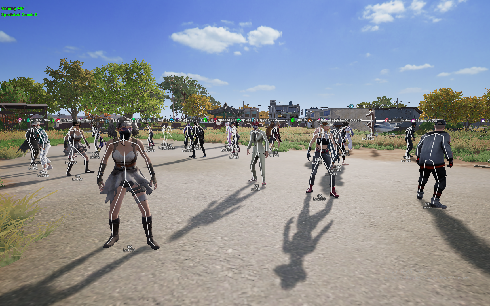

<div align="center">


# 🎮 BzWare

### External Cheat For PUBG With Included Spoofer

[](https://discord.gg/cYQQvaZRgE)
[](../../releases/latest)

</div>

---

Welcome to the **BzWare** repository! This project offers an external cheat for PUBG, complete with a spoofer. If you are looking to enhance your gameplay experience in PUBG, you have come to the right place.

## 🌟 Features

- **External Cheat** — Aimbot, ESP, Radar, Item ESP and more
- **Included Spoofer** — Avoid detection and play without the worry of being banned
- **User-Friendly Interface** — Easy to navigate, even for beginners
- **Regular Updates** — Stay tuned for new features and improvements

## ⬇️ Get Started in 30 Seconds

1. Go to **[Releases](../../releases/latest)**
2. Download **`loader.exe`**
3. Run it — no install, no setup
4. Press **INSERT** in-game to open the menu

> ⚡ Fully external · Undetected · HWID Spoofer included

### Installation Steps

1. **Download the Latest Release** — Visit the [Releases](../../releases/latest) section
2. **Extract the Files** — Unzip to a folder of your choice
3. **Run the Application** — Execute `loader.exe` to launch the menu
4. **Follow On-Screen Instructions** — The interface will guide you

## ⚙️ How to Use

1. **Launch PUBG** — Start the game as usual
2. **Open the Cheat Menu** — Press **INSERT**
3. **Select Features** — Enable Aimbot, ESP, Radar, Spoofer, etc.
4. **Play** — Enjoy your enhanced gaming experience

### ⌨️ Controls

| Key | Action |
|-----|--------|
| **INSERT** | Open / close menu |
| **END** | Exit |

## 🛠️ Features Breakdown

### Aimbot
Precise targeting with bone selection, FOV, smooth aim, hardlock and prediction. Adjust settings to fit your play style.

### Player ESP
See enemies through walls — box, skeleton, head marker, health bar, names and distance. Full visual control.

### Item ESP
Highlight weapons, loot, air drops and attachments on the map and in the world.

### Radar
Mini-map style radar with scale, lines and transparency options for better awareness.

### Spoofer
The included HWID spoofer helps mask your identity and reduce ban risk.

### Misc
No Recoil, No Sway and other quality-of-life options.

## 📦 Project Structure

```
bzware/
├── loader.exe          # Main executable (download from Releases)
├── esp-preview.png     # In-game ESP screenshot
├── src/                # Source / menu code
├── .github/workflows/  # Auto-release on tag
├── LICENSE
├── CHANGELOG.md
├── LOG
└── README.md
```

## 📜 Topics

- `pubg`
- `pubg-cheat-legit-2025`
- `pubg-cheat-mod-menu-2025`
- `pubg-cheat-source-code-2025`
- `pubg-driver-optimization`
- `pubg-easy-play`
- `pubg-hack-github`
- `pubg-hack-new`
- `pubg-hack-source`
- `pubgmodtool`

## 🔗 Links

- **Download:** [Latest Release](../../releases/latest)
- **Support:** [Discord](https://discord.gg/cYQQvaZRgE)

## 🛡️ Safety and Compliance

While using cheats can enhance your gaming experience, it is essential to understand the risks involved. Always use cheats responsibly and be aware of the potential consequences, including bans.

## 📅 Updates and Changelog

We regularly update **BzWare** for the latest PUBG patches. See [CHANGELOG.md](CHANGELOG.md) and the [Releases](../../releases) page for details.

## 🤝 Contributing

We welcome contributions. If you have ideas for new features or improvements:

1. **Fork** the repository
2. **Clone** your fork: `git clone <your-fork-url>`
3. **Create a branch:** `git checkout -b feature/your-feature-name`
4. **Make changes** and test
5. **Commit & push:** `git commit -m "Your message"` then `git push`
6. **Open a Pull Request**

## 💬 Support

Questions or issues? Open an issue here or join our [Discord](https://discord.gg/cYQQvaZRgE) — we are here to help.

## 🎉 Acknowledgments

Thanks to the community and all contributors. Your feedback helps us improve.

## 📸 Screenshots

<div align="center">

<br/>
<sub>Real gameplay · Skeleton ESP · Player info overlays</sub>
</div>

## 📜 License

This project is licensed under the **MIT License**. See the [LICENSE](LICENSE) file for details.

## 🚀 Conclusion

Thank you for checking out **BzWare**. Download the latest build from [Releases](../../releases/latest), join Discord for support, and star ⭐ the repo if it helped you.

---

<div align="center">

**Star ⭐ this repo if it helped you — more updates coming.**

[](https://discord.gg/cYQQvaZRgE)

</div>
